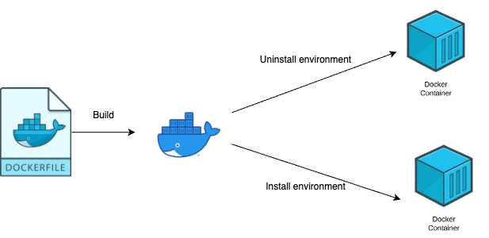
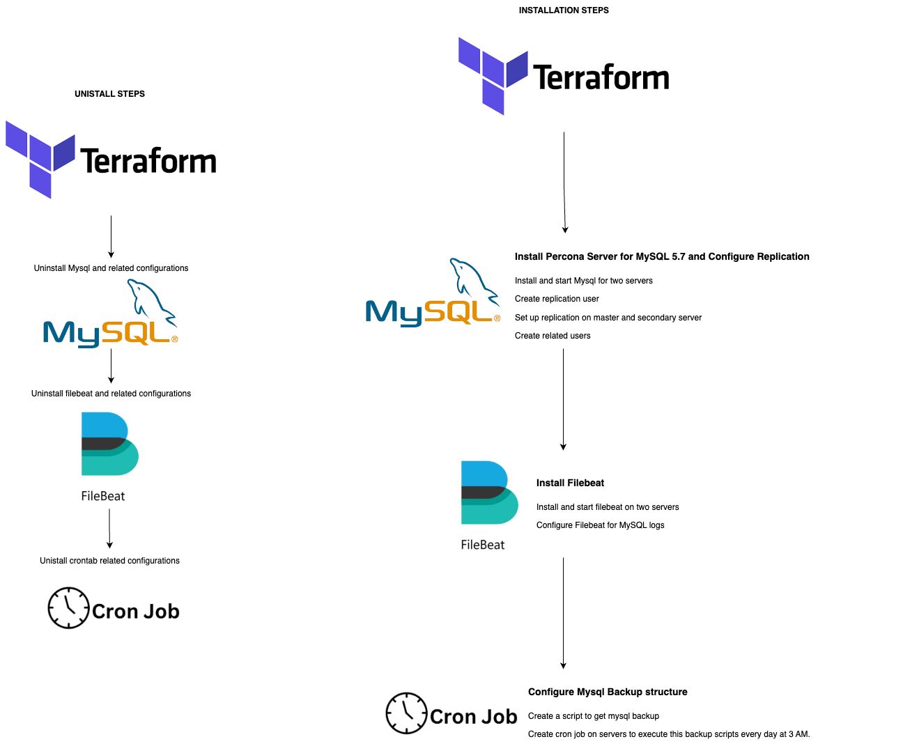

# Database 120

# STRUCTURES
Docker side structure is like the below




 Terraform side structure is like the below



This task is implementing the below steps


# STEPS

* Ensure you have ```docker``` command in your machine.
* Ensure your environment related variables are configured in **ansible/mysql-installation.yml** (https://gitlab.com/fatih-dagli/database-120/-/blob/main/ansible/mysql-installation.yml)

    ```
    vars:
        - db_host1: db-120-primary-prod-66
        - db_host2: db-120-secondary-prod-67
        - replication_user: replication_user
        - replication_password: replication_password
        - elasticsearch_host: elasticsearch-server-1
        - elasticsearch_port: 9200
        - elasticsearch_username: test
        - elasticsearch_password: test
        - mysql_backup_dir: "/opt/mysql/mysql_backup"
        - cron_backup_script: "/opt/mysql/mysql_backup/mysql_backup.sh"
        - days_to_keep_backups: 14 
        - users:
            monitoring:
            username: monitoring
            password: $ecurePassw0rd
            role: read_only
            ado:
            username: ado
            password: $afe'N1invi$ible
            role: admin
    ```

* Ensure your environment related variables are configured in **docker/send_ssh_keys.sh** (https://gitlab.com/fatih-dagli/database-120/-/blob/main/docker/send_ssh_keys.sh)

    * You can use the below commands to encode and decode your mysql hosts' ssh passwords. After you encoded you password, you can use this encoded password in the script.
        ```
            echo 'test123' | base64
            echo 'ZWxhc3RlMTIzCg==' | base64 -d
        ```


* Ensure your environment related variables are configured in **ansible/hosts** (https://gitlab.com/fatih-dagli/database-120/-/blob/main/ansible/hosts)


* Build the docker image using the below command


    ```
    docker build -t ansible-mysql:latest .
    ```

* Use the below command to uninstall your environment. (Uninstall Mysql, filebeat and crontabs)
    ```
    docker run -it ansible-mysql:latest /bin/bash -c "ansible-playbook /root/mysql-uninstallation.yml"
    ```

* Use the below command to preprare your Mysql environment
    ```
    docker run -it ansible-mysql:latest /bin/bash -c "ansible-playbook /root/mysql-installation.yml"
    ```